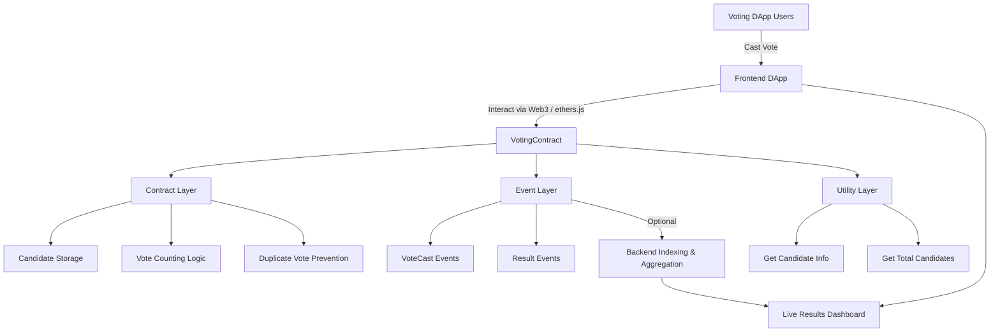

# Voting DApp Smart Contracts
**Blockchain Voting Logic and Core Contract Layer**

## Overview
This repository contains the smart contract code for a blockchain-based Voting DApp. The smart contracts implement the core voting logic, candidate management, and vote tracking, serving as the source of truth for the entire system.

The contracts are designed to be simple, secure, and gas-efficient while enabling future extensions such as admin controls, multiple elections, and enhanced auditing.

---

## Core Idea
The Voting DApp Smart Contracts provide a decentralized and tamper-proof mechanism to conduct elections, ensuring:

- Transparent vote counting  
- Immutable vote history  
- Candidate management  
- Secure, one-vote-per-address enforcement  

By moving the voting logic on-chain, the system ensures trustless operation and auditability.

---

## System Capabilities

### Voting Logic
- **One vote per address:** Prevents double voting  
- **Candidate-based voting:** Votes are mapped to predefined candidates  
- **Vote counting:** On-chain tracking of votes per candidate  

### Candidate Management
- Initialize election with a list of candidate names  
- Query candidate data (name, vote count)  
- Retrieve total number of candidates  

### Security and Validation
- Prevent duplicate votes with `hasVoted` mapping  
- Validate candidate indices during voting  
- Immutable contract state once deployed  

### Utility Functions
- Read-only getters for candidates and votes  
- Query total number of candidates  
- Easily extendable for future elections or features  

---

## High-Level Architecture

### Core Layers
- **Contract Layer:** Implements voting logic and candidate storage  
- **Event Layer:** Emits events for votes and results (optional for backend indexing)  
- **Utility Layer:** Getter functions for read-only access  

This separation ensures simplicity, clarity, and maintainability.

---

## Design Principles
- Minimal and secure on-chain logic  
- Transparent and auditable vote storage  
- Gas-efficient storage and operations  
- Immutable state for trustless elections  
- Modular structure for easy upgrades  

---

## Workflow Summary
1. Deploy `VotingContract` with candidate names  
2. Users connect with wallets to the DApp  
3. Users cast votes via the frontend  
4. Contract updates vote counts and prevents double voting  
5. Backend or frontend reads candidate vote counts  
6. Live dashboard displays up-to-date results  

---

## Technology Stack
- **Language:** Solidity ^0.8.20  
- **Framework:** Hardhat  
- **Testing:** Mocha / Chai  
- **Blockchain:** Ethereum-compatible networks (Local / Testnet / Mainnet)  
- **Deployment:** Hardhat scripts  

---

## Intended Use Cases
- Decentralized voting for organizations or communities  
- Transparent elections with blockchain auditability  
- Integration with DApp frontend dashboards  
- Educational purposes for learning Solidity and smart contract design  

---

## License
This project is licensed under the MIT License.
