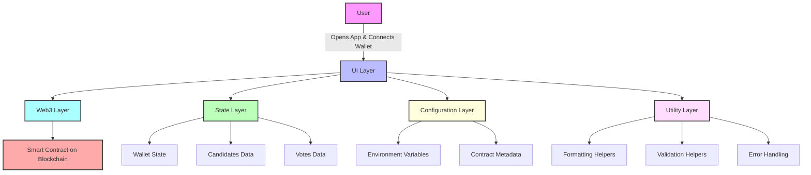

# Voting DApp Frontend
Decentralized Voting Interface with Live Results Dashboard

## Overview
This repository contains the **frontend application** for a blockchain-based Voting DApp. The frontend provides an intuitive, real-time user interface for voters to view candidates, cast votes, and monitor live election results directly from the blockchain. 

The application is designed as a clean, modular Web3 frontend that interacts with a deployed smart contract using a wallet-based authentication flow. It focuses on usability, transparency, and real-time data visibility.

## Core Idea
The Voting DApp Frontend enables users to participate in decentralized elections by combining:

- Wallet-based user authentication  
- Smart contract interaction via Web3  
- Live result visualization  
- Simple and accessible voting UI  

The frontend abstracts blockchain complexity and presents voting as a familiar web experience while preserving decentralization and trustlessness.

## System Capabilities

### Wallet Integration
- MetaMask or Web3-compatible wallet support  
- Secure wallet connection and address detection  
- Network and account change handling  

### Voting Interface
- Display list of candidates fetched from the smart contract  
- One-click vote casting  
- Prevention of duplicate voting (enforced by contract)  
- Clear transaction feedback (pending / confirmed)  

### Live Results Dashboard
- Real-time vote count retrieval from blockchain  
- Automatic UI updates after transactions  
- Transparent visibility of total votes per candidate  

### User Experience
- Minimal and clean UI design  
- Transaction status indicators  
- Error handling for rejected or failed transactions  
- Responsive layout for desktop and mobile  

### Configuration & Utilities
- Environment-based configuration for contract address and RPC  
- Reusable Web3 helper functions  
- Centralized contract ABI management  

## High-Level Architecture
The frontend follows a **component-based architecture** optimized for Web3 interaction.

**Core Layers**:  
- **UI Layer**: Pages and reusable components (Voting, Results, Wallet Connect)  
- **Web3 Layer**: ethers.js logic for blockchain interaction  
- **State Layer**: Application state for wallet, candidates, and votes  
- **Configuration Layer**: Environment variables and contract metadata  
- **Utility Layer**: Helpers for formatting, validation, and errors  

This separation ensures clarity, scalability, and ease of maintenance.

## Design Principles
- User-first Web3 experience  
- Clear separation of UI and blockchain logic  
- Readable, beginner-friendly codebase  
- Minimal abstractions for transparency  
- Easy integration with any EVM-compatible contract  

## Workflow Summary
1. User opens the frontend application  
2. User connects their wallet (MetaMask)  
3. Frontend fetches candidate data from the smart contract  
4. User casts a vote via a blockchain transaction  
5. Transaction is confirmed on-chain  
6. Live results update automatically from the blockchain  

## Technology Stack
- **Language**: JavaScript / TypeScript  
- **Framework**: React (Vite or CRA)  
- **Web3 Library**: ethers.js  
- **Wallet**: MetaMask  
- **Architecture Style**: Component-based Web3 frontend  

## Intended Use Cases
- Decentralized student or community elections  
- Blockchain learning projects  
- Web3 portfolio demonstration  
- Hackathon-ready voting systems  
- Transparent polling and governance tools  

## License
This project is licensed under the MIT License.
